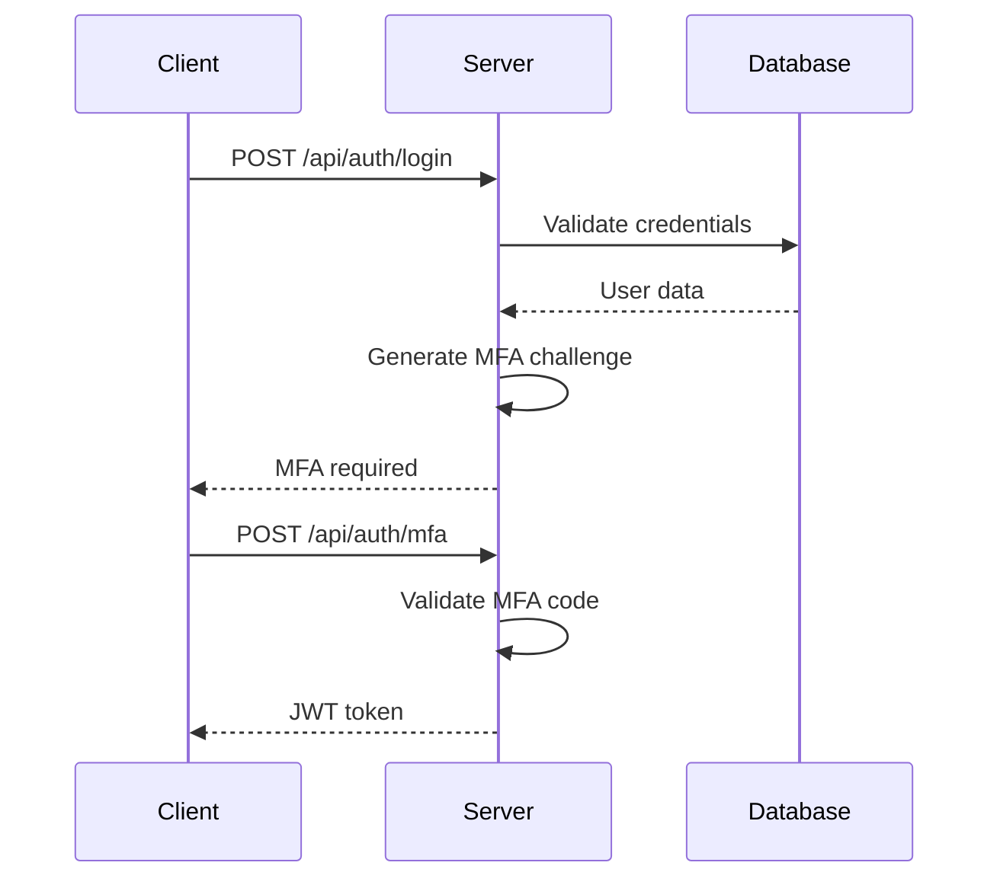

# PR Generator CLI

A command-line tool that generates comprehensive pull request descriptions using the Anthropic API. The tool analyzes git changes and creates professional, well-structured PR descriptions with optional API diagrams.

## Features

- 🔍 **Smart Change Detection**: Analyzes git diffs to understand what changed
- 📝 **Professional PR Descriptions**: Generates comprehensive, well-structured descriptions
- 🎯 **Backend API Documentation**: Automatically detects and documents API endpoint changes
- 📊 **Mermaid Diagrams**: Generates sequence diagrams for API changes
- 🎨 **Frontend/Backend Classification**: Intelligently categorizes changes
- 📋 **Easy Copy-Paste**: Outputs clean Markdown ready for GitHub

## Installation

**Prerequisites**: This project uses [Bun](https://bun.sh/) as the package manager and runtime. Make sure you have Bun installed:

```bash
curl -fsSL https://bun.sh/install | bash
```

1. Clone this repository:
```bash
git clone <repository-url>
cd pr-generator
```

2. Install dependencies:
```bash
bun install
```

3. Build the project:
```bash
bun run build
```

4. Install the CLI globally:
```bash
bun run install-cli
```

**Note**: You'll need a valid Anthropic API key to use the full functionality. You can get one from [Anthropic's website](https://console.anthropic.com/).

## Usage

### Basic Usage

Generate a PR description for changes compared to main branch:
```bash
pr-gen
```

**Demo Mode**: Try the tool without an API key:
```bash
pr-gen --demo
```

### Advanced Usage

```bash
# Use a specific API key
pr-gen --api-key YOUR_API_KEY

# Compare against a different base branch
pr-gen --base-branch develop

# Save output to a file
pr-gen --output pr-description.md

# Skip diagram generation
pr-gen --no-diagram
```

### Environment Variables

You can set your Anthropic API key as an environment variable:
```bash
export ANTHROPIC_API_KEY="your-api-key-here"
pr-gen
```

## Configuration

The tool uses your Anthropic API key to generate descriptions. You can provide it via:
- Command line argument: `--api-key`
- Environment variable: `ANTHROPIC_API_KEY`

If you don't have an API key, you can run the tool in demo mode to see how it works:
```bash
pr-gen --demo
```

## Output Format

The generated PR description includes:

1. **Title**: Clear, concise description of the main change
2. **Overview**: Brief summary of what the PR accomplishes
3. **Key Changes**: Detailed breakdown organized by category
4. **Testing Considerations**: What should be tested and how
5. **Notes for Reviewers**: Specific areas needing attention
6. **Impact**: What the change means for the system and users
7. **API Changes Diagram**: Mermaid sequence diagram (if backend changes detected)

## Examples

### Basic PR Description
```markdown
# User Authentication Enhancement

## Overview
This PR improves the user authentication system by adding multi-factor authentication support and enhancing security measures.

## Key Changes
### Backend
- Added MFA endpoint (`/api/auth/mfa`)
- Enhanced JWT token validation
- Updated user model with MFA fields

### Frontend
- Added MFA setup component
- Enhanced login form with MFA support
- Updated user profile page

## Testing Considerations
- Test MFA setup flow
- Verify token validation
- Test error scenarios
- Validate UI responsiveness

## Notes for Reviewers
- Pay attention to security implications
- Verify MFA flow works correctly
- Check for any breaking changes

## Impact
This change significantly improves application security and user account protection.
```

### With API Diagram
```markdown
## API Changes Diagram


```

## Development

### Project Structure
```
src/
├── index.ts          # CLI entry point
├── generator.ts      # PR generation logic
├── git.ts           # Git operations
├── diagram.ts       # Mermaid diagram generation
└── types.ts         # TypeScript type definitions
```

### Building
```bash
bun run build
```

### Development Mode
```bash
bun run dev
```

## Dependencies

- `@anthropic-ai/sdk`: Anthropic API client
- `commander`: CLI argument parsing
- `simple-git`: Git operations
- `chalk`: Terminal color output
- `inquirer`: Interactive prompts
- `mermaid`: Diagram generation

## License

MIT 